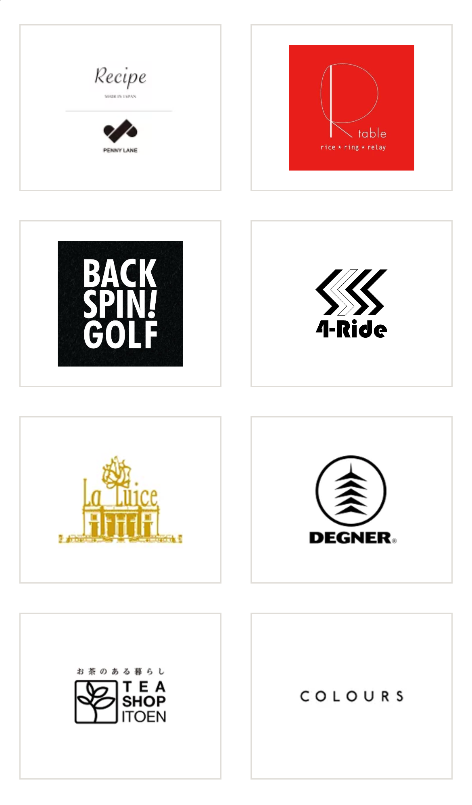
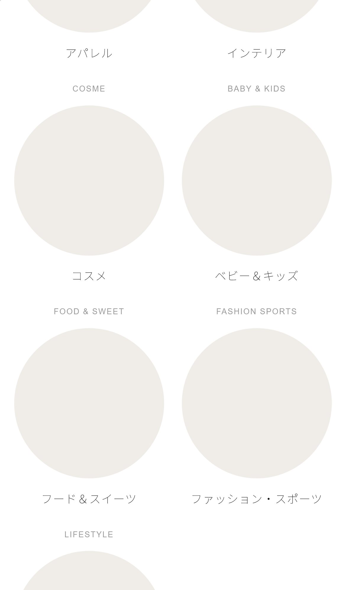
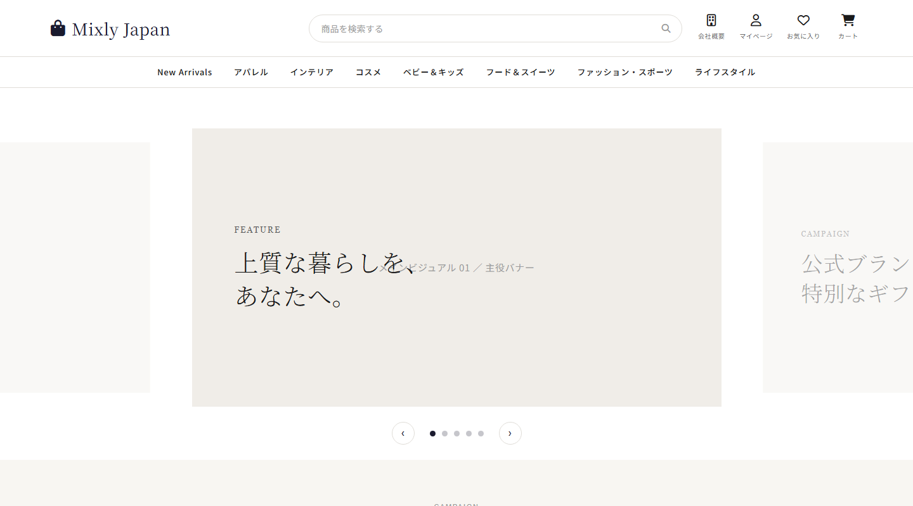

# トラブルシューティング・ナレッジ集

このプロジェクト(Mixly Japan)で実際に直面した、CSS/JSの「よくある不具合」とその原因・直し方の記録です。
同じパターンの不具合に再び出会ったときに、すぐ思い出せるようにまとめています。

---

## 1. モバイルで画面が横スワイプでずれる(右側に余白ができる)

**症状**

iPhone実機でサイトを開くと、横にスワイプ(スクロール)すると右側に余白ができて、ページ全体が横に動いてしまう。PCのブラウザでは特に気づきにくい。

**原因**

CSSのリセットに `box-sizing: border-box` がグローバルに設定されていなかった。
デフォルトの `box-sizing: content-box` では、`padding` や `border` を指定した要素の実際の幅が「指定した幅 + padding + border」になり、本来の幅より広がってしまう。これがあちこちの要素で起きると、ページ全体の横幅がビューポート(画面幅)を超え、横スクロール(スワイプでずれる)が発生する。

**解決方法**

```css
*, *::before, *::after {
    box-sizing: border-box;
}
/* 保険として、何らかの理由でまだ少しはみ出していても
   横スクロール自体は起きないようにブロックする */
html, body {
    overflow-x: hidden;
    max-width: 100%;
}
```

**結果(確認スクリーンショット)**


---

## 2. CSS Gridのセルが画面からはみ出す・他のセクションと重なる

**症状**

ブランド一覧(CSS Grid + ロゴ画像)が、PCのブラウザ検証ツール(DevToolsのモバイルエミュレーション)では正常に見えるのに、実機のSafariで見ると枠が画面の右にはみ出し、下のセクションと重なって表示される。

**原因**

CSS Gridのアイテムは、デフォルトで `min-width: auto` になっている。これは「中身(子要素)の本来のサイズより縮められない」という意味で、子要素に `` がある場合、その画像の**本来の画像サイズ(intrinsic size、実際のピクセル数)** がグリッドの列の最小幅として扱われてしまう。

画像側に `max-width: 78%` のような指定をしていても、**Grid自体がそれより縮められない**ため、列(セル)が広がってページ全体がはみ出す。

これはDevToolsのモバイルエミュレーションでは再現しづらく、実機ブラウザ(特にSafari)で顕在化しやすい、CSS Gridの典型的な落とし穴。

**解決方法**

```css
/* 変更前 */
.brand-grid {
    grid-template-columns: repeat(6, 1fr);
}

/* 変更後: 1fr を minmax(0, 1fr) にすることで、
   列の最小幅を「中身のサイズ」ではなく「0」にできる */
.brand-grid {
    grid-template-columns: repeat(6, minmax(0, 1fr));
}
.brand-grid a {
    min-width: 0; /* グリッドアイテム自身にも明示しておくと安全 */
}
```

**結果(確認スクリーンショット)**




**教訓**

- `grid-template-columns` で `1fr` を使うときは、中に画像や長いテキストが入る可能性があるなら `minmax(0, 1fr)` を基本にする。
- レイアウト崩れの検証は、可能ならChromeのモバイルエミュレーションだけでなく、実機 or WebKitエンジン(Playwrightなら `webkit.launch()`)でも確認する。

---

## 3. カルーセル(Splide.js)のアクティブスライドが中央に来ない

**症状**

`type: 'loop'` + `focus: 'center'` で組んだカルーセルで、アクティブなスライドが中央ではなく左右にズレた位置に表示される。発生条件が一定しない(初回表示時だけズレる、特定方向に送った後だけズレる、など)。

**原因**

Splide.js本体の内部計算(中央寄せのための位置計算)が、ループ用に複製されたスライド(クローン)のどれを参照するかによって、ごく僅かにズレることがある。`focus: 'center'`、`fixedWidth`、`autoWidth`、`padding` オプションのどれを使っても同様の現象が発生し、Splide公式のGitHub issueでも同種の報告がある(`type:'loop'` + `focus:'center'` の既知の弱点)。

**解決方法**

Splide自身の計算結果を信用せず、**画面上の実際の位置を毎回測って補正する**処理を追加した。

```js
function forceCenter() {
    // 全スライド(本物+複製)の中から、画面の水平中央に一番近いものを探す
    // → そのズレ(px)を計算して、トラックの位置を直接補正する
}

// スライド切り替え完了時・リサイズ時・タブ復帰時・ページ復元時、
// すべてのタイミングでこの補正を実行する
splide.on('moved', forceCenter);
window.addEventListener('resize', forceCenter);
document.addEventListener('visibilitychange', forceCenter);
window.addEventListener('pageshow', forceCenter);
```

**結果(確認スクリーンショット)**



**教訓**

- 有名で実績のあるライブラリでも、特定のオプション組み合わせで内部計算がズレることがある。
- 原因をライブラリの内部コードまで完全に特定できなくても、「最終的にどう見えるべきか」を実際のDOM測定で確認し、ズレていたら補正する、という実用的な回避策が効く場合がある。

---

## 今後の追加について

同じような「CSSやJSの典型的な不具合」に遭遇したら、上記と同じ形式(症状・原因・解決方法・結果・教訓)でこのファイルに追記していく。
